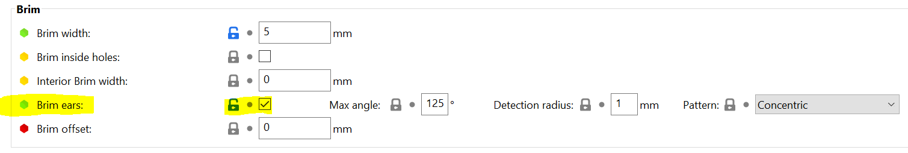
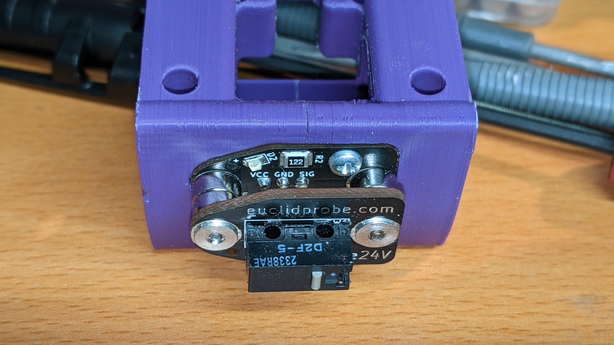
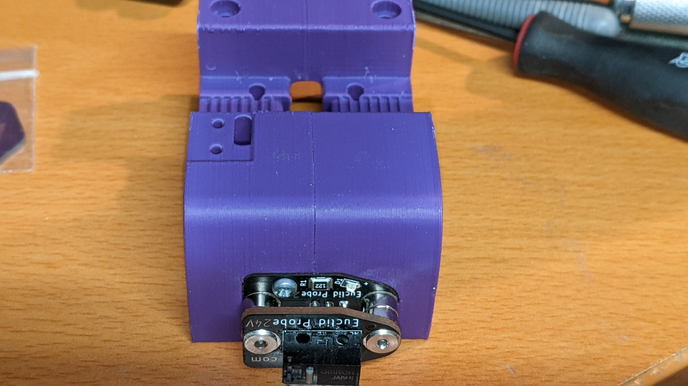
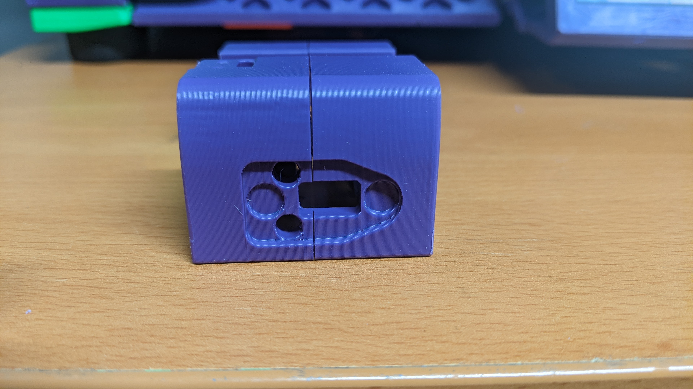

# Euclid-Voron

Modifications of the MGN12 X-Carriage parts from the [Voron 2.4r2 CAD models](https://github.com/VoronDesign/Voron-2/tree/Voron2.4/CAD), for Voron printers.

Euclid PCB model from [Euclid Probe Github](https://github.com/nionio6915/Euclid_Probe/tree/main/CAD)

Now includes modded version of the CW2 X-Carriage!

## Files

[STLs](./STL/)

## Clockwork 1 Versions

Voron_2.4R2_Euclid_CW1_x_carriage_frame_right.stl

Voron_2.4R2_Euclid_CW1_x_carriage_frame_left.stl

## Clockwork 2 Versions

Voron_2.4R2_Euclid_CW2_x_carriage_frame_right.stl

Voron_2.4R2_Euclid_CW2_x_carriage_frame_left.stl

## Notes

Modified the MGN12 X-Carriage parts from the Voron 2.4R2 CAD model for the Euclid probe.

The original Euclid probe x-carriage models are based on the earlier 2.4r1 versions, and while they work fine, this version is updated and slightly cleaner.

* Removed mounting holes for inductive probes, made back of the carriage solid.

* Extended the mounting holes for the Euclid PCB up through the body, you can use either the default 2.5mm coarse thread screws that come with the kit, or M2 10mm self-tapper screws called out for endstop switches. (CW1)
* The CW2 version is intended to be used with M3 heat inserts.

## Printing

Print with the normal Voron print settings.

However, I recommend enabling Brim Ears in SuperSlicer/PrusaSlicer to keep the sharp corners from lifting.

## Pictures

Clockwork 1 Versions

Clockwork 2 Version

