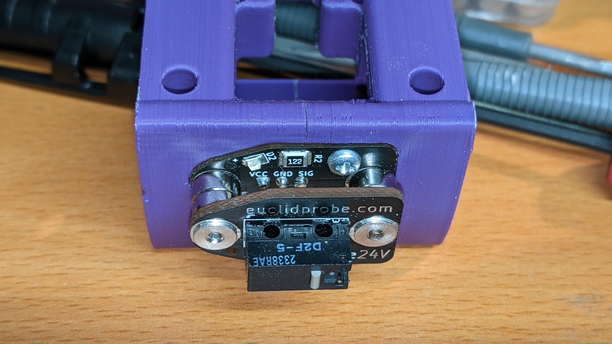

# Euclid-Voron

Modifications of parts from the [Euclid Probe Github](https://github.com/nionio6915/Euclid_Probe), for Voron printers.

# Files

[STLs](./STL/)

Euclid_CW1_MGN12_5 v4.stl

Euclid_CW1_MGN12_6 v4.stl

Modified X-carriage files for Voron 2.4r2/Trident with Clockwork1 extruder:

* Removed mounting holes for inductive probes, made back of the carriage solid.
* Changed the lower screw hole on the X-carriage body to use M3 x 30mm screw, the same as the top. This also removes the magnet hole for hall-effect.
* Extended the mounting holes for the Euclid PCB up through the body, you can use either the default 2.5mm coarse thread screws that come with the kit, or longer M2 self-tappers.

# Printing

Print with the normal Voron print settings.

However, I recommend enabling Brim Ears in SuperSlicer/PrusaSlicer to keep the sharp corners from lifting.

# Pictures

